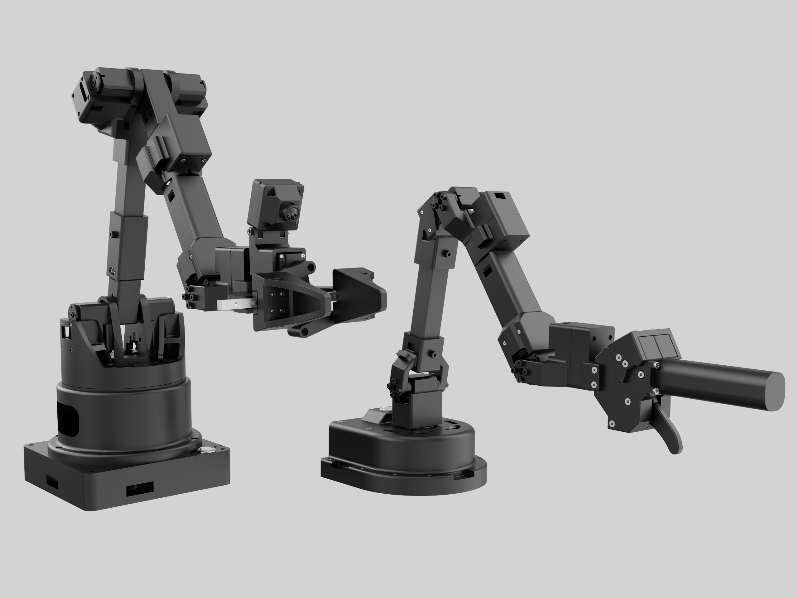

# Alicia-D Real Robot Integration with MoveIt - English Documentation

[English Version](README_EN.md) | [中文版](README.md) | [Official Taobao Store](https://g84gtpygdv6trpvdhcsy0kfr73avcip.taobao.com/shop/view_shop.htm?appUid=RAzN8HWKU5B7MfX6JjEWgkuNfftNVbnrjbjx6fPjY9KqXB46Rvy&spm=a21n57.1.hoverItem.2) | [Alicia-D Product Manual (CN)](https://docs.sparklingrobo.com/)


<p align="center"></p>


The **Alicia-D ROS2** is a ROS2 repository for controlling the "Alicia-D" series of 6-axis robotic arms (with gripper). Built on top of the ROS2 Humble, it provides functionalities to control the arm's movement, operate the gripper, and read posture and status data via serial communication.


## Table of Contents

- [Quick Start](#quick-start)
- [Installation & Setup](#installation--setup)
- [Usage](#usage)
- [Configuration](#configuration)
- [Troubleshooting](#troubleshooting)
- [Architecture](#architecture)
- [Advanced Usage](#advanced-usage)

## Quick Start

### Prerequisites

- ROS 2 Humble installed
- Alicia-D robot connected via USB
- Serial port permissions configured

### 1. Set Serial Port Permissions (One-time)

```bash
sudo usermod -a -G dialout $USER
```

**Then log out and log back in!**

Or temporarily:
```bash
sudo chmod 666 /dev/ttyCH341USB0
```

### 2. Build the Workspace

```bash
cd ~/alicia_ws
colcon build --packages-select alicia_d_driver alicia_d_moveit
source install/setup.bash
```

### 3. Launch Real Robot with MoveIt

```bash
ros2 launch alicia_d_moveit real_robot.launch.py
```

**With custom parameters:**
```bash
ros2 launch alicia_d_moveit real_robot.launch.py \
    robot_version:=v5_6 \
    gripper_type:=100mm \
    port:=/dev/ttyCH341USB0 \
    baud_rate:=1000000 \
    firmware_version:=auto
```

## Installation & Setup

### System Dependencies

```bash
sudo apt update
sudo apt install libserial-dev python3-numpy
sudo apt-get install -y ros-humble-asio-cmake-module ros-humble-io-context
```

### Get Source Code

```bash
mkdir -p ~/alicia_ws/src
cd ~/alicia_ws
git clone https://github.com/Synria-Robotics/Alicia-D-ROS2.git -b v6.0.0 ./src
```

### Build Workspace

```bash
cd ~/alicia_ws
rosdep install --from-paths src --ignore-src -r -y
colcon build
```

### Configure Environment

```bash
echo "source ~/alicia_ws/install/setup.bash" >> ~/.bashrc
source ~/.bashrc
```

### Verify Serial Connection

```bash
ls -l /dev/ttyCH341USB0
# or
ls -l /dev/ttyUSB*
```

## Usage

### Launch Options

#### Option 1: Real Robot with MoveIt (Recommended)

```bash
ros2 launch alicia_d_moveit real_robot.launch.py \
    robot_version:=v5_6 \
    gripper_type:=50mm \
    port:=/dev/ttyCH341USB0 \
    baud_rate:=1000000 \
    firmware_version:=auto
```

#### Option 2: Simulation Only (No Hardware)

```bash
ros2 launch alicia_d_moveit demo.launch.py \
    robot_version:=v5_6 \
    gripper_type:=50mm
```

#### Option 3: Standalone Driver (No MoveIt)

```bash
ros2 launch alicia_d_driver alicia_d_driver.launch.py
```

### Launch File Parameters

| Parameter | Default | Description |
|-----------|---------|-------------|
| `robot_version` | `v5_6` | Robot version (`v5_5` or `v5_6`) |
| `gripper_type` | `50mm` | Gripper stroke (`50mm` or `100mm`) |
| `port` | `/dev/ttyUSB0` | Serial port device |
| `baud_rate` | `1000000` | Serial baud rate |
| `firmware_version` | `auto` | Firmware version (`5.0.0`, `6.0.0`, or `auto` for auto-detection) |

### Using MoveIt in RViz

1. **Set Goal State**
   - Drag interactive markers
   - Or use "Planning" tab → "Select Start State" / "Select Goal State"

2. **Plan Motion**
   - Click "Plan" button
   - Review trajectory in visualization

3. **Execute on Robot**
   - Click "Execute" or "Plan & Execute"
   - Robot will follow the planned trajectory

## Configuration

### Hardware Interface Parameters

The hardware interface is configured in `alicia_d_moveit/config/alicia_d_descriptions.ros2_control.xacro`:

```xml
<hardware>
    <plugin>alicia_d_driver/AliciaDHardwareInterface</plugin>
    <param name="port">/dev/ttyCH341USB0</param>
    <param name="baud_rate">1000000</param>
    <param name="debug_mode">false</param>
    <param name="servo_count">9</param>
    <param name="gripper_type">50mm</param>
    <param name="firmware_version">auto</param>
</hardware>
```

### Controllers Configuration

Controllers are configured in `alicia_d_moveit/config/ros2_controllers.yaml`:

- **Alicia_controller**: Controls joints Joint1-Joint6
- **Gripper_controller**: Controls the right_finger joint
- **joint_state_broadcaster**: Publishes joint states

### MoveIt Controllers

MoveIt controller mapping is in `alicia_d_moveit/config/moveit_controllers.yaml`:

- Maps MoveIt planning groups to ros2_control controllers
- Uses `FollowJointTrajectory` action interface

## Verification Commands


### Monitor Joint States

```bash
ros2 topic echo /joint_states
```


## Special Commands

Running the `alicia_d_driver.launch.py`
```
ros2 launch alicia_d_driver alicia_d_driver.launch.py port:=/dev/ttyCH343USB0 gripper_type:=100mm firmware_version:=6.0.0
```


### Enable Hand-Guiding Mode (Zero Torque)

```bash
ros2 topic pub --once /demonstration std_msgs/msg/Bool "{data: true}"
```

### Disable Hand-Guiding (Restore Torque)

```bash
ros2 topic pub --once /demonstration std_msgs/msg/Bool "{data: false}"
```


### Zero Calibration

Step 1: Disable the torque.
```bash
ros2 topic pub --once /demonstration std_msgs/msg/Bool "{data: true}"
```

Step 2: Place the robot to desire pose.

```bash
ros2 topic pub --once /zero_calibrate std_msgs/msg/Bool "{data: true}"
```


## Troubleshooting

### Connection Issues

**Problem**: Cannot connect to serial port

**Solutions**:
1. Check cable connection
2. Verify port name: `ls /dev/tty*`
3. Check permissions: `ls -l /dev/ttyCH341USB0`
4. Add user to dialout group: `sudo usermod -a -G dialout $USER`
5. Try different port: `port:=/dev/ttyUSB0`

### Controller Failures

**Problem**: Controllers fail to start

**Solutions**:
1. Check that the hardware interface loaded successfully:
   ```bash
   ros2 control list_hardware_interfaces
   ```
2. Verify robot is connected and powered
3. Check controller configuration:
   ```bash
   ros2 control list_controllers
   ```

### Motion Execution Issues

**Problem**: Plans succeed but execution fails

**Solutions**:
1. Verify firmware version is detected correctly (check logs)
2. Ensure gripper type matches your hardware (50mm vs 100mm)
3. Check joint limits in `joint_limits.yaml`
4. Monitor serial communication with `debug_mode:=true`
5. Try specifying firmware version explicitly: `firmware_version:=5.0.0`

### Firmware Version

The system auto-detects firmware version. For manual configuration:

```bash
ros2 launch alicia_d_moveit real_robot.launch.py firmware_version:=5.0.0
```

Or in xacro files:
```xml
<param name="firmware_version">6.0.0</param>  <!-- Instead of "auto" -->
```

## Architecture

```
MoveIt → Joint Trajectory Controllers → ros2_control → Hardware Interface → Serial → Robot
                                                ↓
                                        Joint State Publisher
                                                ↓
                                           /joint_states
```

### Key Components

1. **Hardware Interface** (`alicia_d_hardware_interface.cpp`)
   - Implements the ros2_control `SystemInterface`
   - Handles serial communication with the robot
   - Converts between ROS joint states and hardware protocol
   - Supports firmware version detection and multiple gripper types

2. **ROS2 Control Configuration**
   - **Controller Manager**: Manages all controllers
   - **Joint State Broadcaster**: Publishes joint states to `/joint_states`
   - **Alicia_controller**: Joint trajectory controller for the 6-DOF arm
   - **Gripper_controller**: Joint trajectory controller for the gripper

3. **Launch Files**
   - **real_robot.launch.py**: Launch file for controlling the real robot with MoveIt
   - **demo.launch.py**: Original demo with fake execution (simulation)

## File Structure

```
alicia_d_driver/
├── include/alicia_d_driver/
│   ├── alicia_d_hardware_interface.hpp    # Hardware interface header
│   └── alicia_d_driver_node.hpp            # Standalone driver node
├── src/
│   ├── alicia_d_hardware_interface.cpp     # Hardware interface implementation
│   ├── alicia_d_driver_node.cpp            # Standalone driver
│   └── serial_communicator.cpp             # Serial communication
├── launch/
│   └── alicia_d_driver.launch.py           # Standalone driver launch
├── alicia_d_driver.xml                     # Plugin description
└── CMakeLists.txt

alicia_d_moveit/
├── config/
│   ├── alicia_d_descriptions.ros2_control.xacro  # Hardware interface config
│   ├── ros2_controllers.yaml               # Controller configuration
│   ├── moveit_controllers.yaml             # MoveIt controller mapping
│   └── ...                                 # Other MoveIt configs
├── launch/
│   ├── real_robot.launch.py                # Real robot launch
│   ├── demo.launch.py                      # Simulation launch
│   └── ...                                 # Other launch files
└── package.xml
```

## Safety Notes

⚠️ **Important Safety Guidelines:**

1. Always have emergency stop ready
2. Clear workspace before motion execution
3. Start with slow velocities
4. Test in simulation first
5. Monitor robot during operation
6. Check joint limits are properly configured

## Additional Resources

- [MoveIt 2 Documentation](https://moveit.picknik.ai/main/index.html)
- [ros2_control Documentation](https://control.ros.org/)
- [ROS2 Humble Documentation](https://docs.ros.org/en/humble/)

## Support

For issues or questions:
1. Check the troubleshooting section above
2. Review ROS logs: `~/.ros/log/` or use `ros2 topic echo /rosout`
3. Enable debug mode for more verbose output
4. Check hardware connection and firmware version

---

**Ready to use!** Start with simulation (demo.launch.py) to familiarize yourself with the system, then move to real robot control (real_robot.launch.py).

