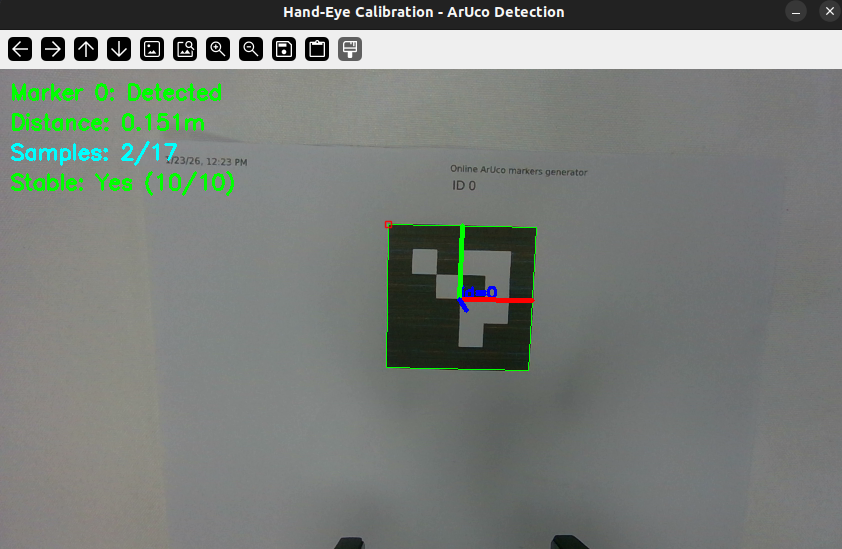

# alicia_d_calibration - 手眼标定模块

本模块为 Alicia-D 机械臂提供手眼标定（Eye-in-Hand）功能，基于 ArUco 标记和相机实现末端执行器到相机的空间变换。

> [!warning]
> 本模块以 Intel Realsense D405 和 Orbbec Gemini 335 相机为例。如使用其它相机，可能需要修改相关文件。

## 📋 模块说明

**alicia_d_calibration** 是一个完整的手眼标定解决方案，用于：
- 计算机械臂末端与相机之间的空间关系
- 输出标定结果转换矩阵
- 支持各种 ArUco 标记配置
- 提供标定结果验证功能

## 📁 文件结构

```
alicia_d_calibration/
├── scripts/
│   ├── hand_eye_calibration.py             # 手眼标定主脚本
│   ├── generate_calibration_poses.py       # 生成标定位置序列
│   └── aruco_detector.py                   # ArUco 标记检测器
├── launch/
│   ├── hand_eye_calibration.launch.py      # 标定启动文件
│   └── verify_calibration.launch.py        # 标定验证启动文件
├── config/
│   └── hand_eye_calibration_result.yaml    # 标定结果输出文件
├── package.xml                             
├── CMakeLists.txt                          
└── README.md                          
```

## 🚀 快速开始

### 1. 环境准备

在运行标定前，确保需要的环境已经设置：

```bash
# 创建 conda 环境（如果需要）
conda create -n calib python=3.10 -y
conda activate calib
conda install pip -y

# 安装依赖
pip install "numpy<2.0.0" "opencv-python<4.11" scipy pyyaml jinja2 typeguard
```

> [!note]
> 若非明确指定，请尽量确保退出 ``conda`` 再运行程序 ：
> ```bash
> conda deactivate
> ```


### 2. 启动必要的节点

在不同的终端中依次启动：

**终端 1：启动机械臂驱动和 MoveIt**

> ``gripper type`` 根据实际情况修改（50/100mm）

```bash
ros2 launch alicia_d_moveit real_robot.launch.py gripper_type:=50mm
```

**终端 2：启动相机驱动**

若使用Realsense D405:

```bash
ros2 launch realsense2_camera rs_launch.py \
    enable_infra1:=true \
    enable_infra2:=true \
    infra_rgb:=true \
    pointcloud.enable:=true
```

若使用Gemini 335:

```bash
ros2 launch orbbec_camera gemini_330_series.launch.py \
    enable_left_ir:=true \
    enable_right_ir:=true \
    enable_point_cloud:=true \
    enable_colored_point_cloud:=true
```

### 3. 运行标定

> 请将ArUco码平放在机械臂正前方30～35cm处。

**终端 3：执行标定启动文件**

激活 ``conda`` 环境:

```bash
conda activate calib
```

执行标定启动文件（默认适配Realsense D405）：

```bash
ros2 launch alicia_d_calibration hand_eye_calibration.launch.py
```

若使用Gemini 335相机，请添加参数：

```bash
ros2 launch alicia_d_calibration hand_eye_calibration.launch.py \
    camera_topic:=/camera/color/image_raw \
    camera_info_topic:=/camera/color/camera_info
```

标定结束后，标定结果会自动保存在 ``alicia_d_calibration/config/hand_eye_calibration_result.yaml``

<p align="center"></p>

### 4. 验证标定结果

> 请先 ``CTRL+C`` 终止标定启动文件

**终端 3：执行标定验证文件**

若使用Realsense D405相机：
```bash
ros2 launch alicia_d_calibration verify_calibration.launch.py
```
若使用Gemini 335相机，请添加参数：
```bash
ros2 launch alicia_d_calibration verify_calibration.launch.py \
    camera_topic:=/camera/color/image_raw \
    camera_info_topic:=/camera/color/camera_info
```

**终端 4：验证标定**

查看 TF 树：
```bash
ros2 run rqt_tf_tree rqt_tf_tree --force-discover
```

验证标定结果:
```bash
ros2 run tf2_ros tf2_echo base_link aruco_marker_frame
```

同时可在``rviz``中添加``pointcloud2``，观察点云与机械臂的相对位置关系。

## ✅ 标定流程

1. **准备阶段**：确保相机标定参数正确，打印或显示 ArUco 标记
2. **采集阶段**：脚本自动移动机械臂，在 20+ 个不同位置采集数据
3. **计算阶段**：利用采集的数据计算手眼变换矩阵
4. **保存阶段**：标定结果保存为 YAML 文件
5. **验证阶段**：通过验证脚本测试标定精度
